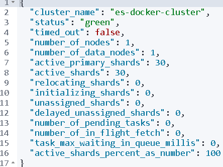
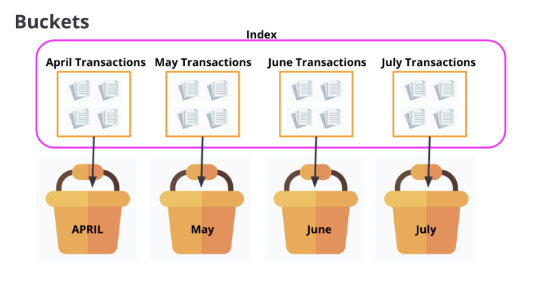

# Docker - PHP - Laravel Project For Basic Functionality

[Github][1] [Docker][2] is a **Docker and PHP** repository


Setup
------------

* Run Docker Containers
  
  * ``docker compose up -d `` - For a standard build / setup
  * ``bash ./bin/dev-mode.sh -d`` - For a development build / setup
  * ``{XDEBUG_MODE=debug,coverage} bash ./bin/dev-mode.sh -d {--build}`` - For a development build / setup with XDEBUG
  * ``XDEBUG_MODE=debug,coverage bash ./bin/dev-mode.sh -d --build`` - For a development build / setup with XDEBUG

* Run Composer install to populate vendor folder
  
  ``docker exec app composer install`` 

[//]: # (  * ``composer install --ignore-platform-reqs --working-dir=./app``)

* Install the dependencies inside package.json
  
  ``docker exec app yarn install``


* Compile Assets (css/js changes inside /public/build)

  ``docker exec app yarn encore dev``


* Run Migration

  ``docker exec app symfony console doctrine:migrations:migrate --no-interaction``


* Populate the Database
 
  ``docker exec app symfony console doctrine:fixtures:load --no-interaction``


Useful Info
------------

> [!PHPSTORM] PHP Storm -> Settings -> PHP -> Set "CLI Interpreter"
> 
> Pick "Docker" 
> 
> Image name: "kmtsvetanov/symfony-php-composer:1.0"
> 
>  This will use php 8.2.11


* For installing Docker Desktop on Windows if you wish to use another directory (C: is full) in cmd:
  
  * ``start /w "" "Docker Desktop Installer.exe" install -accept-license --installation-dir="D:\WORK\DOCKER-VIRTUAL\Docker" --wsl-default-data-root="D:\WORK\DOCKER-VIRTUAL\wsl" --windows-containers-default-data-root="D:\WORK\DOCKER-VIRTUAL"``


* Create Images for Prod and store them in DockerHub:
  
  * ``docker login -u <<username>>`` 
  * ``docker build --target app -t <<username>>/symfony-php-composer:1.0 -f ./docker/php/Dockerfile .``
  * ``docker build -t <<username>>/symfony-nginx-php:1.0 -f ./docker/nginx/Dockerfile .`` 
  * ``docker push <<username>>/symfony-php-composer:1.0`` 
  * ``docker push <<username>>/symfony-nginx-php:1.0`` 
  
  * ``docker login -u kmtsvetanov`` 
  * ``docker build --target app -t kmtsvetanov/symfony-php-composer:1.0 -f ./docker/php/Dockerfile .``
  * ``docker build -t kmtsvetanov/symfony-nginx-php:1.0 -f ./docker/nginx/Dockerfile .`` 
  * ``docker push kmtsvetanov/symfony-php-composer:1.0`` 
  * ``docker push kmtsvetanov/symfony-nginx-php:1.0`` 


* We checked if our [environment can run symfony][3] (run inside `setup-app`)
  * ``symfony check:requirements``


* [Install Symfony][4]
  * ``composer create-project symfony/skeleton:"6.3.*" my_project_directory``

<h4>General commands</h4>
  * ``docker exec app bin/console cache:clear`` - Clear the cache in a Symfony application

<h3>Useful Symfony commands </h3>

  * ``symfony console make:controller MoviesController`` - Create a controller
  * ``symfony console debug:router`` - Show all routes
  * ``symfony console doctrine:database:create`` - Create a database
  * ``symfony console make:entity Movie`` - Create/Edit Entity and Repository
    * Check comments 
  
[//]: # (  Movie - Actor --- ManyToMany  - Many 'Movies' have many 'Actors' - Many 'Actors' start in many 'Movies' )
[//]: # (  ``symfony console make:entity Actor`` - Create Entity and Repository)
[//]: # (  ``symfony console make:entity Movie`` -  New property "actors"  One movie - Many Actors | One Actor - Many Movies )
[//]: # ( - actors)
[//]: # ( - ManyToMany)
[//]: # ( - Actor)
[//]: # ( - yes)
[//]: # ( - movies)
[//]: # ([//]: # &#40;  Student  - Project --- ManyToOne  &#41; - Many 'Students' are working on one school 'Project' | One 'Project' has many 'Students' that work on the project)
[//]: # ([//]: # &#40;  Country  - States  --- OneToMany  &#41; - One 'Country' has many 'States' | One 'State' is located in only one 'Country')
[//]: # ([//]: # &#40;  Person   - Heart   --- OneToOne  &#41; - One 'Person' has one 'Heart' | One 'Heart' inside the body of one 'Person')

  * ``symfony console make:migration`` - Create Migration
  * ``symfony console doctrine:migrations:migrate`` - Run Migration
  * ``symfony console doctrine:migrations:migrate prev`` - Roll back the last migration

<h4>Fixtures - Load Dummy Data Fixtures</h4> 
  * ``docker exec app composer require --dev doctrine/doctrine-fixtures-bundle``
  * ``symfony console doctrine:fixtures:load`` - Database will be purged and populated

<h4>Compile Assets in Symfony (node + yarn)</h4> (inside 'app' container)
  * ``composer require webpack`` - Will install symfony/webpack-encore-bundle
  * ``yarn install`` - Will the dependencies inside package.json
  * ``yarn encore dev`` - Compile Assets (css/js changes inside /public/build)

<h4>Symfony Form class</h4>
  * ``composer require symfony/form``
  * ``symfony console make:form MovieFormType Movie`` - created: src/Form/MovieFormType.php + associate the model (Movie) that will use

<h4>Symfony User</h4> 
  * ``symfony console make:user User`` - Create user table (have  Questions) - yes | email | yes
  * ``symfony console make:migration`` - Create Migration
  * ``symfony console doctrine:migrations:migrate`` - Run Migration
  * ``symfony console make:registration-form`` - Create register form (have  Questions) - yes | no | yes | the redirect route
  * ``symfony console make:auth`` - Create LoginForm (have  Questions) - 1 | LoginFormAuthenticator | SecurityController | yes | no

<h4>Symfony Messenger: Sync & Queued Message Handling</h4>
  * ``composer require symfony/messenger``
  * ``symfony console make:message ProcessTaskMessage`` - This will generate a message class, ProcessTaskMessage, in the src/Message | async
  * ``symfony console debug:messenger`` - To see all the configured handlers, run:
  * ``symfony console messenger:consume async -vv`` - Consuming Messages (Running the Worker) - (-vv) to see all the configured handlers

<h4>Symfony microservice</h4>


  * ProductsController->lowestPrice
    * POST request:
      * URL: `http://localhost/products/1/lowest-price?XDEBUG_SESSION_START=PHPSTORM` 
      * Headers
        * Accept: application/json
        * Content-Type: application/json
        * Force-fail: 500
      * Body: {
        "quantity": 5,
        "request_location": "UK",
        "voucher_code": "0U812",
        "request_date": "2022-04-04",
        "product_id": 1
        }

<h4>Entities vs DTOs (Data Transfer Objects)</h4> 
  * Entities represent the real things in your 
  application.
  * DTOs are like data carriers that help you move 
  data between different parts of your application. They keep things 
  organized and make sure data arrives where it's supposed to be. 

<h6>Schema</h4>


* ``composer require doctrine/annotations``

<h4>Tests</h4>
* ``vendor/bin/phpunit tests/unit/LowestPriceFilterTest.php``

<h4>Caching</h4>
* ``composer require cache``
* ``symfony console cache:pool:delete cache.app valid-for-product-1`` - Clear an Item out of the cache
* ``composer require predis/predis`` - Library for helping php work with Redis

<h4>Events vs Symfony Message Handling</h4>
- Events:
   - Think of events as "notifications" in your application.
   - Use events when you want your application to react to things that happen, like sending an email when a user signs up or logging an action.
   - Events are like a bell that rings when something important happens in your app.
- Symfony Console's make:message Command:
   - Imagine you have a "to-do list" for your application.
   - Use the make:message command to create "tasks" that your application can work on in the background.
   - It's like writing down tasks on a list, and your application completes them when it has time.
* ``composer require validator``
* ``symfony console debug:autowiring EventDispatcher`` - The following classes & interfaces can be used as type-hints when autowiring
* ``vendor/bin/phpunit tests/unit/DtoSubscriberTest.php``


<h4>Setup SQLite in-memory test database</h4>
* ``composer require dama/doctrine-test-bundle --dev`` - A Symfony bundle that provides helpful tools and utilities for testing Doctrine database-related functionality in Symfony applications. 
  It can be particularly useful for creating and managing test databases, loading fixtures, and isolating your tests from the actual database, making it easier to write and maintain tests.
* ``symfony console make:command`` - Used to generate a new console command for your Symfony application. 
  *  Choose a command name - `app:refresh-stock-profile`
*  ``composer require serializer`` - 'app:refresh-stock-profile'
* `vendor/bin/phpunit tests --exclude-group integration`
* `vendor/bin/phpunit tests --group integration` - Run only integration tests


<h4>[Elasticsearch and Kibana][5] </h4>


* <b>Elasticsearch</b> - A powerful tool that
  helps developers store, search, and analyze data, making it easier to build applications
  that require fast and efficient data retrieval.
  It's commonly used for tasks like searching text, monitoring system logs, and analyzing business data. It works well with other tools like Logstash and Kibana, which can help you process and visualize your data.
* <b>Kibana</b> -  allows developers and data analysts to create interactive, real-time dashboards and visualizations to gain insights from their data. Kibana is often used in conjunction with Elasticsearch to build user-friendly interfaces for exploring and understanding data.


* http://localhost:5601/app/dev_tools#/console commands
	* `GET _cluster/health` - Get info about cluster health
  
    

    * `GET _nodes/stats` - Get info about nodes in a cluster (Good for debugging)
	
<h5>Performing CRUD operations</h5>
* C - Create an index
			
    Syntax:
    ````
    PUT Name-of-the-Index
    ````

    Example
    ````
    PUT favorite_candy
    ````

    Response Status - 200 Ok 
    
    
                
      
* Index a document (ID) - When indexing a document, both HTTP verbs POST or PUT can be used.
                
    * Use `POST` when you want Elasticsearch to autogenerate an id for your document.

        Syntax:
        ````
        POST Name-of-the-Index/_doc
        {
            "field": "value"
        }
        ````
      
        Example:
        ````
        POST favorite_candy/_doc
        {
            "first_name": "Lisa",
            "candy": "Sour Skittles"
        }
        ````

        Response - Status - 201 Created
  
		

    * Use `PUT` when you want to assign a specific id to your document(i.e. if your document has a natural identifier - purchase order number, patient id, & etc).
		
        Syntax:
        ````
        PUT Name-of-the-Index/_doc/id-you-want-to-assign-to-this-document
        {
            "field": "value"
        }
        ````
		
        Example:
        ````
        PUT favorite_candy/_doc/1
        {
            "first_name": "John",
            "candy": "Starburst"
        }
        ````
		
        Response - Status - 201 Created
  
		

	* _create Endpoint - If you do not want a existing document to be overwritten, you can use the _create endpoint!
		Syntax:
        ````
        PUT Name-of-the-Index/_create/id-you-want-to-assign-to-this-document
        {
            "field": "value"
        }
        ````
      
		Example:
        ````
        PUT favorite_candy/_create/1
        {
            "first_name": "Finn",
            "candy": "Jolly Ranchers"
        }
        ````
		
        Response on existing id - Status - 409 Conflict
  
		


* R - READ
    * Read a document
        
        Syntax:
        ````
        GET Name-of-the-Index/_doc/id-of-the-document-you-want-to-retrieve
        ````
		
        Example:
        ````
        GET favorite_candy/_doc/1
        ````
       
        Response on existing id - Status - 200 Ok
  
		
		

* U - UPDATE 
    * Update a document - If you want to update fields in a document, use the following syntax:
      
        Syntax:
        ````
        POST Name-of-the-Index/_update/id-of-the-document-you-want-to-update
        {
            "doc": {
                "field1": "value",
                "field2": "value",
            }
        } 
        ````
      
        Example:
        ````
        POST favorite_candy/_update/1
        {
            "doc": {
                "candy": "M&M's"
            }
        }
        ````
      
        Response on existing id - Status - 200 Ok
  
		
					
					
* D - DELETE 
    * Delete a document
        Syntax:
        ```
        DELETE Name-of-the-Index/_doc/id-of-the-document-you-want-to-delete
        ````
		
        Example:
        ```
        DELETE favorite_candy/_doc/1
        ```
    
        Response on existing id - Status - 200 Ok
  
        

<h1>Elasticsearch and Kibana - Relevance of a search</h1>


> [News Headlines Dataset][6] - Download the demo dataset the query examples

<h2>Queries - Retrieve documents that match the criteria.</h2>

* <h3>Retrieve information about documents in an index </h3>

    Syntax:
    ```
    GET enter_name_of_the_index_here/_search
    ````
    
    Example:
    ```
    GET news_headlines/_search
    ```
    
    Response on existing id - Status - 200 Ok
    
    

    * hits = matches found
      * value = max default is 10 000
      * relation - gte (greater than or equal) = they may be more than 10 000

* <h3>EXACT TOTAL NUMBER Retrieve information about documents in an index </h3>

    Syntax:
    ````
    GET enter_name_of_the_index_here/_search
    {
        "track_total_hits": true
    }
    ````

    Example:
    ````
    GET news_headlines/_search
    {
        "track_total_hits": true
    }
    ````

    Response on existing id - Status - 200 Ok

    

    * hits
        * relation - eq (equal) = the total hits in the database
      

<h3>Search for data within a specific time range</h2>

Example:
````
GET news_headlines/_search
{
  "query": {
    "range": {
      "date": {
        "gte": "2015-06-20",
        "lte": "2015-09-22"
      }
    }
  }
}
````

<h2>Aggregations - It summarizes your data as metrics, statistics, and other analytics.</h2>

<h3>Analyze the data to show the categories of news headlines in our dataset</h3>

Syntax: 
````
GET enter_name_of_the_index_here/_search
{
  "aggs": {
    "name your aggregation here": {
      "specify aggregation type here": {
        "field": "name the field you want to aggregate here",
        "size": state how many buckets you want returned here
      }
    }
  }
}
````

Example:
````
GET news_headlines/_search
{
  "aggs": {
    "by_category": {
      "terms": {
        "field": "category",
        "size": 100
      }
    }
  }
}
````

Response - Status - 200 Ok:


* aggregations
  * buckets - The different categories and the number of hits there


<h2>A combination of query and aggregation request</h2>

<h3>Search for the most significant term (significant_text) in a category</h3>

Syntax:
````
GET enter_name_of_the_index_here/_search
{
  "query": {
    "match": {
      "Enter the name of the field": "Enter the value you are looking for"
    }
  },
  "aggregations": {
    "Name your aggregation here": {
      "significant_text": {   # it's Important
        "field": "Enter the name of the field you are searching for"
      }
    }
  }
}
````

Example:
````
GET news_headlines/_search
{
  "query": {
    "match": {
      "category": "ENTERTAINMENT"
    }
  },
  "aggregations": {
    "popular_in_entertainment": {
      "significant_text": {
        "field": "headline"
      }
    }
  }
}
````

Response - Status - 200 Ok:


<h2>Precision and Recall</h2>

<h3>Increasing Recall</h3>

Syntax:
````
GET enter_name_of_index_here/_search
{
  "query": {
    "match": {
      "Specify the field you want to search": {
        "query": "Enter search terms"
      }
    }
  }
}
````

Example:
````
GET news_headlines/_search
{
  "query": {
    "match": {
      "headline": {
        "query": "Khloe Kardashian Kendall Jenner" # I hit requires only one of them (OR operator)
      }
    }
  }
}
````

Expected response from Elasticsearch:

By default, the match query uses an "OR" logic. If a document contains one of the search terms (Khloe, Kardashian, Kendall or Jenner), Elasticsearch will consider that document as a hit.

"OR" logic results in higher number of hits, thereby increasing recall. However, the hits are loosely related to the query and lowering precision as a result.

Response - Status - 200 Ok:


<h3>Increasing Precision</h3>
We can increase precision by adding an "and" operator to the query.

Syntax:
````
GET enter_name_of_index_here/_search
{
  "query": {
    "match": {
      "Specify the field you want to search": {
        "query": "Enter search terms",
        "operator": "and"
      }
    }
  }
}
````

Example:
````
GET news_headlines/_search
{
  "query": {
    "match": {
      "headline": {
        "query": "Khloe Kardashian Kendall Jenner",
        "operator": "and"   // REQUIRES ALL 4 TO MATCH
      }
    }
  }
}
````

Response - Status - 200 Ok:


<h3>minimum_should_match</h3>

This parameter allows you to specify the minimum number of terms a document should have to be included in the search results.

This parameter gives you more control over fine tuning precision and recall of your search.

Syntax:
````
GET enter_name_of_index_here/_search
{
  "query": {
    "match": {
      "headline": {
        "query": "Enter search term here",
        "minimum_should_match": Enter a number here
      }
    }
  }
}
````

Example:
````
GET news_headlines/_search
{
  "query": {
    "match": {
      "headline": {
        "query": "Khloe Kardashian Kendall Jenner",
        "minimum_should_match": 3   // 3 OUT OF 4 MUST MATCH (AND operator)
      }
    }
  }
}
````


<h1>Full Text Queries</h1>

<h2>Searching for search terms</h2>

The `match query` is a standard query for performing a full text search. This query retrieves documents that contain the search terms. It uses "OR" logic by default, meaning that it will retrieve documents that contain any one of the search terms. The order and the proximity in which the search terms are found(i.e. phrases) are not taken into account.

Syntax:
````
GET Enter_name_of_index_here/_search
{
  "query": {
    "match": {  // <-- here (OR operator by default) (The order is not important)
      "Specify the field you want to search": {
        "query": "Enter search terms"
      }
    }
  }
}
````

<h2>Searching for phrases using the `match_phrase` query</h2>

If the order and the proximity in which the search terms are found(i.e. phrases) are important in determining the relevance of your search, you use the match_phrase query.

Syntax:
````
GET Enter_name_of_index_here/_search
{
  "query": {
    "match_phrase": {
      "Specify the field you want to search": {
        "query": "Enter search terms"
      }
    }
  }
}
````

Example:
````
GET news_headlines/_search
{
  "query": {
    "match_phrase": {   // <-- here
      "headline": {
        "query": "Shape of You"
      }
    }
  }
}
````
- the search terms "Shape", "of", and "you" must appear in the field headline .
- the terms must appear in that order.
- the terms must appear next to each other.


<h2>Running a match query against multiple fields `multi_match` query</h2>

Syntax:
````
GET Enter_the_name_of_the_index_here/_search
{
  "query": {
    "multi_match": {
      "query": "Enter search terms here",
      "fields": [
        "List the field you want to search over",
        "List the field you want to search over",
        "List the field you want to search over"
      ]
    }
  }
}
````

Example:
````
GET news_headlines/_search
{
  "query": {
    "multi_match": { //  <-- here (OR operator by default) (The order is not important)
      "query": "Obama Michelle",
      "fields": [
        "headline",
        "short_description",
        "authors"
      ]
    }
  }
}
````

<h2>Per-field boosting</h2>

To improve the precision of your search, you can designate one field to carry more weight than the others.

This can be done by boosting the score of the field headline(per-field boosting). This is notated by adding a carat(^) symbol and number 2 to the desired field as shown below.

Syntax:
````
GET Enter_the_name_of_the_index_here/_search
{
  "query": {
    "multi_match": {
      "query": "Enter search terms",
      "fields": [
        "List field you want to boost^2",
        "List field you want to search over",
        "List field you want to search over"
      ]
    }
  }
}
````

Example:
````
GET news_headlines/_search
{
  "query": {
    "multi_match": {
      "query": "Michelle Obama",
      "fields": [
        "headline^2", // <-- here (^2  can be 2,3,4,5,....) - 2 times more important than matches in other fields
        "short_description",
        "authors"
      ]
    }
  }
}
````

<h2>How to use `multi_match` query to search for a `phrase`?</h2>

Syntax:
````
GET Enter_the_name_of_the_index_here/_search
{
  "query": {
    "multi_match": {    // <-- here
      "query": "Enter search phrase",
      "fields": [
        "List field you want to boost^2",
        "List field you want to search over",
        "List field you want to search over"
      ],
      "type": "phrase"  // <-- here
    }
  }
}
````

Example:
````
GET news_headlines/_search
{
  "query": {
    "multi_match": {
      "query": "party planning",
      "fields": [
        "headline^2",
        "short_description"
      ],
      "type": "phrase"
    }
  }
}
````

<h2>Combined query and aggregation request</h2>

Syntax:
````
GET Enter_name_of_the_index_here/_search
{
  "query": {
    "Enter match or match_phrase here": { "Enter the name of the field": "Enter the value you are looking for" }
  },
  "aggregations": {
    "Name your aggregation here": {
      "Specify aggregation type here": {
        "field": "Name the field you want to aggregate here",
        "size": State how many buckets you want returned here
      }
    }
  }
}
````

Example:

The following query ask Elasticsearch to query all data that has the phrase "Michelle Obama" in the headline. Then, perform aggregations on the queried data and retrieve up to 100 categories that exist in the queried data.
````
GET news_headlines/_search
{
  "query": {
    "match_phrase": {
      "headline": "Michelle Obama"
    }
  },
  "aggregations": {
    "category_mentions": {
      "terms": {
        "field": "category",
        "size": 100
      }
    }
  }
}
````

Result


<h2>Combined Queries</h2>

There will be times when a user asks a multi-faceted question that requires multiple queries to answer.

For example, a user may want to find political headlines about Michelle Obama published before the year 2016.

This search is actually a combination of three queries:

- Query headlines that contain the search terms "Michelle Obama" in the field headline.
- Query "Michelle Obama" headlines from the "POLITICS" category.
- Query "Michelle Obama" headlines published before the year 2016

One of the ways you can combine these queries is through a `bool` query.

<h3>[Bool Query][7] -  retrieves documents matching boolean combinations of other queries.</h3>

There are four `clauses` to choose from:
- `must`
- `must_not`
- `should`
- `filter`

Each `clause` can contain one or multiple queries that specify the criteria of each clause.

Syntax:
````
GET name_of_index/_search
{
  "query": {
    "bool": {   // <-- here
      "must": [ // <-- here
        {One or more queries can be specified here. A document MUST match all of these queries to be considered as a hit.}
      ],
      "must_not": [ // <-- here
        {A document must NOT match any of the queries specified here. It it does, it is excluded from the search results.}
      ],
      "should": [   // <-- here
        {A document does not have to match any queries specified here. However, it if it does match, this document is given a higher score.}
      ],
      "filter": [   // <-- here
        {These filters(queries) place documents in either yes or no category. Ones that fall into the yes category are included in the hits. }
      ]
    }
  }
} 
````

<h3>The `must` clause</h4>

The must clause defines all queries(criteria) a document MUST match to be returned as hits. These criteria are expressed in the form of one or multiple queries.

All queries in the must clause must be satisfied for a document to be returned as a hit. As a result, having more queries in the must clause will increase the precision of your query.

Syntax:
````
GET Enter_name_of_the_index_here/_search
{
  "query": {
    "bool": {
      "must": [
        {
        "Enter match or match_phrase here": {
          "Enter the name of the field": "Enter the value you are looking for" 
         }
        },
        {
          "Enter match or match_phrase here": {
            "Enter the name of the field": "Enter the value you are looking for" 
          }
        }
      ]
    }
  }
}
````

Example:
````
GET news_headlines/_search
{
  "query": {
    "bool": {
      "must": [
        {
        "match_phrase": {
          "headline": "Michelle Obama"
         }
        },
        {
          "match": {
            "category": "POLITICS"
          }
        }
      ]
    }
  }
}
````

<h3>The `must_not` clause</h3>

The must_not clause defines queries(criteria) a document MUST NOT match to be included in the search results.

Syntax:
````
GET Enter_name_of_the_index_here/_search
{
  "query": {
    "bool": {
      "must": [
        {
        "Enter match or match_phrase here": {
          "Enter the name of the field": "Enter the value you are looking for" 
         }
        },
       "must_not":[
         {
          "Enter match or match_phrase here": {
            "Enter the name of the field": "Enter the value you are looking for"
          }
        }
      ]
    }
  }
}
````

Example:
````
GET news_headlines/_search
{
  "query": {
    "bool": {
      "must": {
        "match_phrase": {
          "headline": "Michelle Obama"
         }
        },
       "must_not":[
         {
          "match": {
            "category": "WEDDINGS"
          }
        }
      ]
    }
  }
}
````

<h3>The `should` clause</h3>

The should clause adds "nice to have" queries(criteria). The documents do not need to match the "nice to have" queries to be considered as hits. However, the ones that do will be given a higher score so it shows up higher in the search results.

Syntax:
````
GET Enter_name_of_the_index_here/_search
{
  "query": {
    "bool": {
      "must": [
        {
          "Enter match or match_phrase here": {
            "Enter the name of the field": "Enter the value you are looking for" 
          }
        }
      ],
      "should":[
         {
          "Enter match or match_phrase here": {
            "Enter the name of the field": "Enter the value you are looking for"
          }
        }
      ]
    }
  }
}
````

Example:
````
GET news_headlines/_search
{
  "query": {
    "bool": {
      "must": [
        {
        "match_phrase": {
          "headline": "Michelle Obama"
          }
         }
        ],
       "should":[
         {
          "match_phrase": {
            "category": "BLACK VOICES"
          }
        }
      ]
    }
  }
}
````

<h3>The `filter` clause</h3>

The filter clause contains filter queries that place documents into either "yes" or "no" category.

For example, let's say you are looking for headlines published within a certain time range. Some documents will fall within this range(yes) or do not fall within this range(no).

The filter clause only includes documents that fall into the yes category.

Syntax:
````
GET Enter_name_of_the_index_here/_search
{
  "query": {
    "bool": {
      "must": [
        {
        "Enter match or match_phrase here": {
          "Enter the name of the field": "Enter the value you are looking for" 
         }
        }
        ],
       "filter":{
          "range":{
             "date": {
               "gte": "Enter lowest value of the range here",
               "lte": "Enter highest value of the range here"
          }
        }
      }
    }
  }
}
````

Example:
````
GET news_headlines/_search
{
  "query": {
    "bool": {
      "must": [
        {
        "match_phrase": {
          "headline": "Michelle Obama"
          }
         }
        ],
       "filter":{
          "range":{
             "date": {
               "gte": "2014-03-25",
               "lte": "2016-03-25"
          }
        }
      }
    }
  }
}
````

<h2>Aggregations</h2>
- **REMINDER** Queries retrieve documents that match the specified criteria.
- **REMINDER** Aggregations present the summary of your data as metrics, statistics, and other analytics.

We will use another [E-commerce Dataset][8]

Often times, the dataset is not optimal for running requests in its original state.

For example, the type of a field may not be recognized by Elasticsearch or the dataset may contain a value that was accidentally included in the wrong field and etc.

Copy and paste these requests into the Kibana console(Dev Tools) and run these requests in the order shown below.

<h3> SET UP</h3>
**STEP 1: Create a new index(ecommerce_data) with the following mapping.**
````
PUT ecommerce_data
{
  "mappings": {
    "properties": {
      "Country": {
        "type": "keyword"
      },
      "CustomerID": {
        "type": "long"
      },
      "Description": {
        "type": "text"
      },
      "InvoiceDate": {           // Changed from: {
        "type": "date",          //     "type": "keyword"
        "format": "M/d/yyyy H:m" // }
      },
      "InvoiceNo": {
        "type": "keyword"
      },
      "Quantity": {
        "type": "long"
      },
      "StockCode": {
        "type": "keyword"
      },
      "UnitPrice": {
        "type": "double"
      }
    }
  }
}
````

**STEP 2: Reindex (Change name) the data from the original index(source) to the one you just created(destination).**
````
POST _reindex
{
  "source": {
    "index": "name of your original index when you added the data to Elasticsearch"
  },
  "dest": {
    "index": "ecommerce_data"
  }
}
````

**STEP 3: Remove the negative values from the field "UnitPrice".**

When you explore the minimum unit price in this dataset, you will see that the minimum unit price value is -11062.06. To keep our data simple, I used the delete_by_query API to remove all unit prices less than 0.
````
POST ecommerce_data/_delete_by_query
{
  "query": {
    "range": {
      "UnitPrice": {
        "lte": 0
      }
    }
  }
}
````

Retrieve only the last document based on a specific field
````
GET ecommerce_data/_search
{
  "size": 1,
  "sort": [
    {
      "UnitPrice": {
        "order": "asc"
      }
    }
  ]
}  
````

**STEP 4: Remove values greater than 500 from the field "UnitPrice".**

When you explore the maximum unit price in this dataset, you will see that the maximum unit price value is 38,970. 
When the data is manually examined, the majority of the unit prices are less than 500. The max value of 38,970 would 
skew the average. To simplify our demo, I used the delete_by_query API to remove all unit prices greater than 500.
````
POST ecommerce_data/_delete_by_query
{
  "query": {
    "range": {
      "UnitPrice": {
        "gte": 500
      }
    }
  }
}
````


<h2>Aggregations Reques</h2>

Syntax:
````
GET Enter_name_of_the_index_here/_search
{
  "aggs": {
    "Name your aggregations here": {
      "Specify the aggregation type here": {
        "field": "Name the field you want to aggregate on here"
      }
    }
  }
}
````

<h3>Metric Aggregations</h3>

Metric aggregations are used to compute numeric values based on your dataset. 
It can be used to calculate the values of `sum`, `min`, `max`, `avg`, unique count(`cardinality`) etc.

<h4>Compute the sum of all unit prices in the index</h4>

Syntax:
````
GET Enter_name_of_the_index_here/_search
{
  "aggs": {
    "Name your aggregations here": {
      "sum": {      // <-- here
        "field": "Name the field you want to aggregate on here"
      }
    }
  }
}
````

Example:
````
GET ecommerce_data/_search
{
    // <-- "track_total_hits": true, IS NOT NEEDED HERE
  "aggs": {
    "sum_unit_price": {
      "sum": {      // <-- here
        "field": "UnitPrice"
      }
    }
  }
}
````

If the purpose of running an aggregation is solely to get the aggregations results, 
you can add a size parameter and set it to 0 as shown below. This parameter prevents Elasticsearch 
from fetching the top 10 hits so that the aggregations results are shown at the top of the response.

````
GET ecommerce_data/_search
{
  "size": 0,            // <-- here
  "aggs": {
    "sum_unit_price": {
      "sum": {          // <-- here
        "field": "UnitPrice"
      }
    }
  }
}
````


<h4>Compute the lowest(min) unit price of an item</h4>

````
GET ecommerce_data/_search
{
  "size": 0,
  "aggs": {
    "lowest_unit_price": {
      "min": {      // <-- here
        "field": "UnitPrice"
      }
    }
  }
}
````

<h4>Compute the highest(max) unit price of an item</h4>
````
GET ecommerce_data/_search
{
  "size": 0,
  "aggs": {
    "highest_unit_price": {
      "max": {      // <-- here
        "field": "UnitPrice"
      }
    }
  }
}
````

<h4>Compute the average unit price of items</h4>
````
GET ecommerce_data/_search
{
  "size": 0,
  "aggs": {
    "average_unit_price": {
      "avg": {      // <-- here
        "field": "UnitPrice"
      }
    }
  }
}
````

<h3>`Stats` Aggregation: Compute the `count`, `min`, `max`, `avg`, `sum` in one go</h3>
````
GET ecommerce_data/_search
{
  "size": 0,
  "aggs": {
    "all_stats_unit_price": {
      "stats": {        // <-- here
        "field": "UnitPrice"
      }
    }
  }
}
````


<h3>`Cardinality` Aggregation</h3>
The `cardinality` aggregation computes the count of unique values for a given field.
````
GET ecommerce_data/_search
{
  "size": 0,
  "aggs": {
    "number_unique_customers": {
      "cardinality": {      // <-- here
        "field": "CustomerID"
      }
    }
  }
}
````


<h2>Limiting the scope of an aggregation</h2>
Syntax:
````
GET Enter_name_of_the_index_here/_search
{
  "size": 0,
  "query": {
    "Enter match or match_phrase here": {
      "Enter the name of the field": "Enter the value you are looking for"
    }
  },
  "aggregations": {
    "Name your aggregations here": {
      "Specify aggregations type here": {
        "field": "Name the field you want to aggregate here"
      }
    }
  }
}
````

Example: (Calculate the average unit price of items sold in Germany.)
````
GET ecommerce_data/_search
{
  "size": 0,
  "query": {
    "match": {
      "Country": "Germany"
    }
  },
  "aggs": {
    "germany_average_unit_price": {
      "avg": {
        "field": "UnitPrice"
      }
    }
  }
}
````

The combination of query and aggregations request allowed us to perform aggregations on a subset of documents. What if we wanted to perform aggregations on several subsets of documents?

This is where `Bucket Aggregations` come into play!

<h2>Bucket Aggregations</h2>
When you want to aggregate on several subsets of documents, bucket aggregations will come in handy. 
Bucket aggregations group documents into several sets of documents called buckets. All documents in a bucket share a common criteria.



The following are different types of `bucket` aggregations.

- Date Histogram Aggregation
- Histogram Aggregation
- Range Aggregation
- Terms aggregation

<h3>Date Histogram Aggregation</h3>
When you are looking to group data by time interval, the `date_histogram` aggregation will prove very useful!

There are two ways to define a time interval with date_histogram aggregation. 
These are `Fixed_interval` and `Calendar_interval`.

- Fixed_interval - The interval is a constant
 
    ````
    GET ecommerce_data/_search
    {
      "size": 0,
      "aggs": {
        "transactions_by_8_hrs": {
          "date_histogram": {       // <-- here
            "field": "InvoiceDate",
            "fixed_interval": "8h"  // <-- here
          }
        }
      }
    }
    ````

    


- Calendar_interval - The interval may vary.

    ````
    GET ecommerce_data/_search
    {
      "size": 0,
      "aggs": {
        "transactions_by_month": {
          "date_histogram": {           // <-- here
            "field": "InvoiceDate",
            "calendar_interval": "1M",  // <-- here
            "order": {                  // <-- optional order
              "_key": "desc"
            }
          }
        }
      }
    }
    ````

    

    Elasticsearch creates monthly buckets. Within each bucket, the date(monthly interval) is included in the field "key_as_string". The field "key" shows the same date represented as a timestamp. The field "doc_count" shows the number of documents that fall within the time interval.


<h3>Histogram Aggregation</h3>

The histogram aggregation creates buckets based on any numerical interval.

Ex. Create a buckets based on price interval that increases in increments of 10.
````
GET ecommerce_data/_search
GET ecommerce_data/_search
{
  "size": 0,
  "aggs": {
    "transactions_per_price_interval": {
      "histogram": {                    // <-- here
        "field": "UnitPrice",
        "interval": 10,
        "order": {                      // <-- optional order
          "_key": "desc"
        }
      }
    }
  }
}
````


<h3>Range Aggregation</h3>

The range aggregation is similar to the histogram aggregation in that it can create buckets based on any numerical interval. The difference is that the range aggregation allows you to define intervals of varying sizes so you can customize it to your use case.

For example, what if you wanted to know the number of transactions for items from varying price ranges(between 0 and $50, between $50-$200, and between $200 and up)?

````
GET ecommerce_data/_search
{
  "size": 0,
  "aggs": {
    "transactions_per_custom_price_ranges": {
      "range": {                        // <-- here
        "field": "UnitPrice",
        "ranges": [                     // <-- here (note: the otder is based on the ranges orger, NOT like from the top examples)
          {
            "to": 50
          },
          {
            "from": 50,
            "to": 200
          },
          {
            "from": 200
          }
        ]
      }
    }
  }
}
````

<h3>Terms aggregation</h3>

The terms aggregation creates a new bucket for every unique term it encounters for the specified field. It is often used to find the most frequently found terms in a document.

For example, let's say you want to identify 5 customers with the highest number of transactions(documents).

````
GET ecommerce_data/_search
{
  "size": 0,
  "aggs": {
    "5_customers_with_lowest_number_of_transactions": {
      "terms": {                                // <-- here
        "field": "CustomerID",
        "size": 5,                              // <-- default 10
        "order": {                              // <-- optional order
          "_count": "asc"
        }
      }
    }
  }
}
````

<h2>Combined Aggregations</h2>

There will be times when we will ask more complex questions that require running combinations of these aggregations.

For example, let's say we wanted to know the sum of revenue per day.

To get the answer, we need to first split our data into daily buckets(date_histogram aggregation).

- Step: 1 - Calculate the daily revenue

````
GET ecommerce_data/_search
{
  "size": 0,
  "aggs": {
    "transactions_per_day": {
      "date_histogram": {
        "field": "InvoiceDate",
        "calendar_interval": "day"
      },
      "aggs": {
        "daily_revenue": {
          "sum": {
            "script": {
              "source": "doc['UnitPrice'].value * doc['Quantity'].value"
            }
          }
        }
      }
    }
  }
}
````


- Step: 2 - Calculating multiple metrics per bucket

````
GET ecommerce_data/_search
{
  "size": 0,
  "aggs": {
    "transactions_per_day": {
      "date_histogram": {
        "field": "InvoiceDate",
        "calendar_interval": "day"
      },
      "aggs": {
        "daily_revenue": {
          "sum": {
            "script": {
              "source": "doc['UnitPrice'].value * doc['Quantity'].value"
            }
          }
        },
        "number_of_unique_customers_per_day": {     // <-- new here
          "cardinality": {
            "field": "CustomerID"
          }
        }
      }
    }
  }
}
````


<h3>Sorting by metric value of a sub-aggregation</h3>

You do not always need to sort by time interval, numerical interval, or by doc_count! You can also sort by metric value of sub-aggregations.

Let's say you wanted to find which day had the highest daily revenue to date!
````
GET ecommerce_data/_search
{
  "size": 0,
  "aggs": {
    "transactions_per_day": {
      "date_histogram": {
        "field": "InvoiceDate",
        "calendar_interval": "day",
        "order": {                      // <-- here
          "daily_revenue": "desc"
        }
      },
      "aggs": {
        "daily_revenue": {
          "sum": {
            "script": {
              "source": "doc['UnitPrice'].value * doc['Quantity'].value"
            }
          }
        },
        "number_of_unique_customers_per_day": {
          "cardinality": {
            "field": "CustomerID"
          }
        }
      }
    }
  }
}
````

<h1>Mapping</h1>

Mapping defines how a document and its fields are indexed and stored!

<h2>Indexing a Document</h2>

Syntax:
````
POST Enter-name-of-the-index/_doc
{
  "field": "value"
}
````

Example:
````
POST temp_index/_doc
{
  "name": "Pineapple",
  "botanical_name": "Ananas comosus",
  "produce_type": "Fruit",
  "country_of_origin": "New Zealand",
  "date_purchased": "2020-06-02T12:15:35",
  "quantity": 200,
  "unit_price": 3.11,
  "description": "a large juicy tropical fruit consisting of aromatic edible yellow flesh surrounded by a tough segmented skin and topped with a tuft of stiff leaves.These pineapples are sourced from New Zealand.",
  "vendor_details": {
    "vendor": "Tropical Fruit Growers of New Zealand",
    "main_contact": "Hugh Rose",
    "vendor_location": "Whangarei, New Zealand",
    "preferred_vendor": true
  }
}
````

Get the mapping of an index
````
GET temp_index/_mapping
````


<h2>Dynamic Mapping</h2>

When a user DOES NOT define mapping in advance, Elasticsearch CREATES OR UPDATES the mapping as needed by default. This is known as `dynamic mapping`.

<h3>Inverted Index</h3>


<h3>Keyword Field Type</h3>

Keyword field type is used for aggregations, sorting, and exact searches. These actions look up the document ID to find the values it has in its fields.

Keyword field is suited to perform these actions because it uses a data structure called `doc values` to store data.

For each document, the document id along with the field value(original string) are added to the table. This data structure(doc values) is designed for actions that require looking up the document ID to find the values it has in its fields.

<h2>Optimizing Mapping Exercise</h2>

**Project: Build an app for a client who manages a produce warehouse**

This app must enable users to:

1. Search for produce name, country of origin and description

2. Identify top countries of origin with the most frequent purchase history

3. Sort produce by produce type(Fruit or Vegetable)

4. Get the summary of monthly expense

Sample data:

````
{
  "name": "Pineapple",
  "botanical_name": "Ananas comosus",
  "produce_type": "Fruit",
  "country_of_origin": "New Zealand",
  "date_purchased": "2020-06-02T12:15:35",
  "quantity": 200,
  "unit_price": 3.11,
  "description": "a large juicy tropical fruit consisting of aromatic edible yellow flesh surrounded by a tough segmented skin and topped with a tuft of stiff leaves.These pineapples are sourced from New Zealand.",
  "vendor_details": {
    "vendor": "Tropical Fruit Growers of New Zealand",
    "main_contact": "Hugh Rose",
    "vendor_location": "Whangarei, New Zealand",
    "preferred_vendor": true
  }
}
````

<h3>Plan of Action</h3>
1. Search for produce name, country of origin and description
- The field `name`, `country_of_origin` and `description` are **strings** => So by default they will be mapped twice (**as text and keyword**)
    - The user may type only 2-3 words, and we need to check every one word in the fields for a match - **full text searchable**
      - `name` and `description` - **field types required: text**
    - The client doesn't want to run aggregation, sorting or exact searches on fields `name` and `description`
      - `name` and `description` - **field types removed: keyword**
    - country_of_origin - TBD
2. Identify top countries of origin with the most frequent purchase history
- We will need terms aggregation on `country_of_origin`
  - `country_of_origin` -  **field types required: keyword** 
3. Sort produce by produce type(Fruit or Vegetable)
- The field `produce_type` is a **string** => So by default it will be mapped twice (**as text and keyword**)
   - Sorting - **field types required: keyword**
   - The client doesn't want to run full text search - **field types removed: text**
4. Get the summary of monthly expense
- The field `date_purchased`, `quantity` and `unit_price` are used
  - Split data into monthly buckets (**data histogram aggregation**)
  - Calculate monthly expenses for each bucket
  - Create another summary_of_monthly_expense on calculation

Final decision for mapping:
- `name` - field types: text
- `country_of_origin` - field types: keyword
- `description` - field types: text
- `produce_type` - field types: keyword
- `date_purchased` - is used: we keep its default
- `quantity` - is used: we keep its default
- `unit_price` - is used: we keep its default
- `botanical_name` - not used: we can disable it
- `vendor_details` - not used: we can disable it

Example Create mapping:
````
PUT produce_index
{
  "mappings": {
    "properties": {
      "botanical_name": {
        "enabled": false
      },
      "country_of_origin": {
        "type": "keyword"
      },
      "date_purchased": {
        "type": "date"
      },
      "description": {
        "type": "text"
      },
      "name": {
        "type": "text"
      },
      "produce_type": {
        "type": "keyword"
      },
      "quantity": {
        "type": "long"
      },
      "unit_price": {
        "type": "float"
      },
      "vendor_details": {
        "enabled": false
      }
    }
  }
}
````

Index the two documents (the 2-nd has one more field that will be dynamically set)
````
POST produce_index/_doc
{
  "name": "Pineapple",
  "botanical_name": "Ananas comosus",
  "produce_type": "Fruit",
  "country_of_origin": "New Zealand",
  "date_purchased": "2020-06-02T12:15:35",
  "quantity": 200,
  "unit_price": 3.11,
  "description": "a large juicy tropical fruit consisting of aromatic edible yellow flesh surrounded by a tough segmented skin and topped with a tuft of stiff leaves.These pineapples are sourced from New Zealand.",
  "vendor_details": {
    "vendor": "Tropical Fruit Growers of New Zealand",
    "main_contact": "Hugh Rose",
    "vendor_location": "Whangarei, New Zealand",
    "preferred_vendor": true
  }
}
````

and
````
POST produce_index/_doc
{
  "name": "Mango",
  "botanical_name": "Harum Manis",
  "produce_type": "Fruit",
  "country_of_origin": "Indonesia",
  "organic": true,
  "date_purchased": "2020-05-02T07:15:35",
  "quantity": 500,
  "unit_price": 1.5,
  "description": "Mango Arumanis or Harum Manis is originated from East Java. Arumanis means harum dan manis or fragrant and sweet just like its taste. The ripe Mango Arumanis has dark green skin coated with thin grayish natural wax. The flesh is deep yellow, thick, and soft with little to no fiber. Mango Arumanis is best eaten when ripe.",
  "vendor_details": {
    "vendor": "Ayra Shezan Trading",
    "main_contact": "Suharto",
    "vendor_location": "Binjai, Indonesia",
    "preferred_vendor": true
  }
}
````

4. Get the summary of monthly expense - Final step using `runtime field`:
<h2>runtime field</h2>

Step 1: Create a runtime field and add it to the mapping of the existing index.
Syntax:
````
PUT Enter-name-of-index/_mapping
{
  "runtime": {
    "Name-your-runtime-field-here": {
      "type": "Specify-field-type-here",
      "script": {
        "source": "Specify the formula you want executed"
      }
    }
  }
}
````

Example:
````
PUT produce_index/_mapping
{
  "runtime": {
    "total": {              // <-- if you ever receave a request against the field "total"
      "type": "double",     // --- create a runtime (at the run time only) field "total" 
      "script": {           // --- and calculate it's value by running this script.
        "source": "emit(doc['unit_price'].value * doc['quantity'].value)"
      }
    }
  }
}
````

How to use it:
````
GET produce_index/_search
{
  "size": 0,
  "aggs": {
    "total_expense": {
      "sum": {
        "field": "total"
      }
    }
  }
}
````


FINAL PART FOR step: 4.
````
GET produce_index/_search
{
  "size": 0,
  "aggs": {
    "monthly_expenses": {
      "date_histogram": {
        "field": "date_purchased",
        "calendar_interval": "month",
        "format": "yyyy-MM",            // <-- we can add return format
        "min_doc_count": 1
      },
      "aggs": {
        "total_monthly_expense": {
          "sum": {
            "field": "total"
          }
        }
      }
    }
  }
}
````


<h2>Defining your own mapping</h2>
<h3>Rules</h3>
1. If you do not define a mapping ahead of time, Elasticsearch dynamically creates the mapping for you.
2. If you do decide to define your own mapping, you can do so at index creation.
3. ONE mapping is defined per index. Once the index has been created, we can only add new fields to a mapping. We CANNOT change the mapping of an existing field.
4. If you must change the type of existing field, you must create a new index with the desired mapping, then reindex all documents into the new index.

<h1>SonarQube - static testing analysis software.</h1>

Used to manage source code quality and consistency

- Potential bugs
- Code defects to design inefficiencies
- Code duplication
- Lack of test coverage
- Excess complexity

`bash ./bin/sonarqube-scanner.sh` - run SonarQube scanner

Code coverage
`docker exec app vendor/bin/phpunit tests --coverage-html tests/coverage` - drop the /tests/coverage/index.html into a browser
`docker exec app vendor/bin/phpunit tests --coverage-clover=tests/coverage.xml` -  Generate code coverage report in PHPUnit XML format

On merge into main we want to:
------------
* Run the tests
* Build our two images
* Login to the registry (DockerHub)
* Push our built images to the registry


* Irl we would then deploy our code to whatever cloud service we use


[1]: https://github.com/KMTsvetanov/Symfony
[2]: https://hub.docker.com/search?q=kmtsvetanov%2Fsymfony
[3]: https://symfony.com/doc/current/setup.html#technical-requirements
[4]: https://symfony.com/doc/current/setup.html#creating-symfony-applications
[5]: https://www.youtube.com/watch?v=gS_nHTWZEJ8&list=PL_mJOmq4zsHZYAyK606y7wjQtC0aoE6Es&index=1&ab_channel=OfficialElasticCommunity
[6]: https://www.kaggle.com/datasets/rmisra/news-category-dataset
[7]: https://www.elastic.co/guide/en/elasticsearch/reference/6.8/query-dsl-bool-query.html#:~:text=Bool%20Queryedit,clause%20with%20a%20typed%20occurrence.
[8]: https://www.kaggle.com/datasets/carrie1/ecommerce-data

